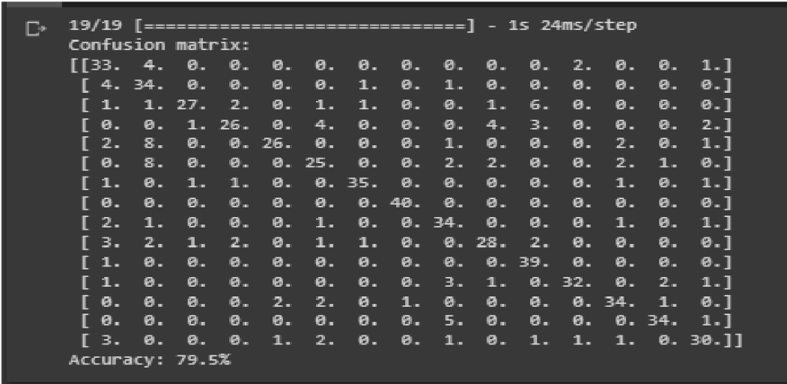
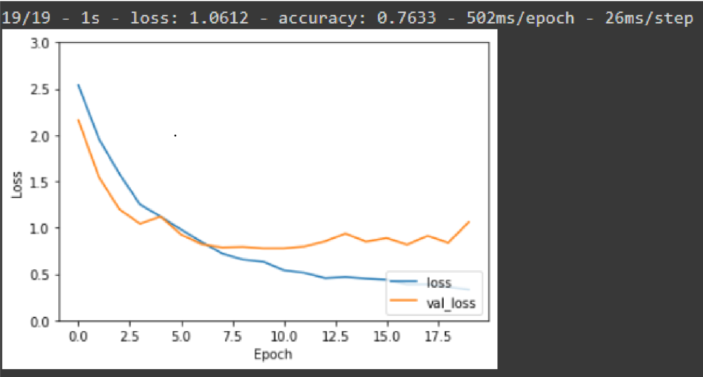

# Vegetable Classifying Convolutional Neural Network (CNN)

## Overview
This project involves developing a Convolutional Neural Network (CNN) to classify images of vegetables into 15 different categories. The project was implemented as part of ENEL 525 - Machine Learning for Engineers at the University of Calgary.

## Dataset
The dataset used for this project is sourced from Ahmed et al. (2021) and contains 21,000 images, with 1,400 images per class. The vegetable classes include:
- Bean
- Bitter Gourd
- Bottle Gourd
- Brinjal
- Broccoli
- Cabbage
- Capsicum
- Carrot
- Cauliflower
- Cucumber
- Papaya
- Potato
- Pumpkin
- Radish
- Tomato

Due to limitations in processing power, only 1/5 of the dataset was used for training, validation, and testing.

## Model Architecture
The model consists of three convolutional layers, each followed by max pooling layers, and a fully connected (dense) layer with dropout for regularization.

### Network Overview

## Confusion Matrix
The model achieved an accuracy of 79.5% on the test set. Below is the confusion matrix showing the model's performance across different classes:

## Training Curve
The training curve illustrates the loss and validation loss over 20 epochs, indicating steady improvement in the model's performance.

## Methodology
The network was trained with the following parameters:

- **Learning Rate**: 0.0005
- **Optimizer**: Adam
- **Loss Function**: Categorical Cross-Entropy
- **Number of Epochs**: 20
- **Batch Size**: 32

### Training Parameters
| Parameter      | Value      |
|----------------|------------|
| Learning Rate  | 0.0005     |
| Optimizer      | Adam       |
| Loss Function  | Categorical Cross-Entropy |
| Number of Epochs | 20       |

## Results and Discussion
The model performed well with a training accuracy of 79.5% on the test set. It successfully classified most vegetable images correctly, as depicted in the confusion matrix above. Further improvements could be made with access to more computational resources and a larger percentage of the dataset.

## Acknowledgments
This project was completed with guidance from Professor Henry Leung and Professor Mohamed Sahnoon. The dataset was sourced from [Kaggle](https://www.kaggle.com/datasets/misrakahmed/vegetable-image-dataset).
